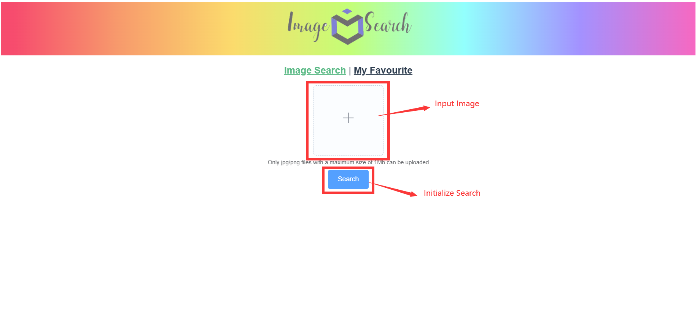
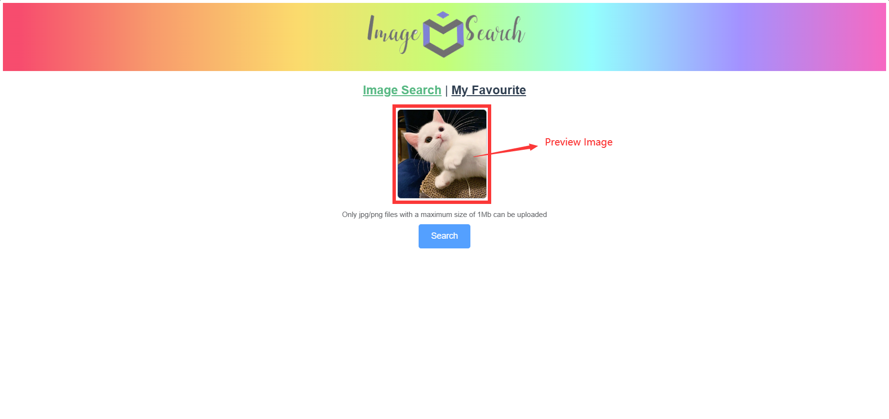
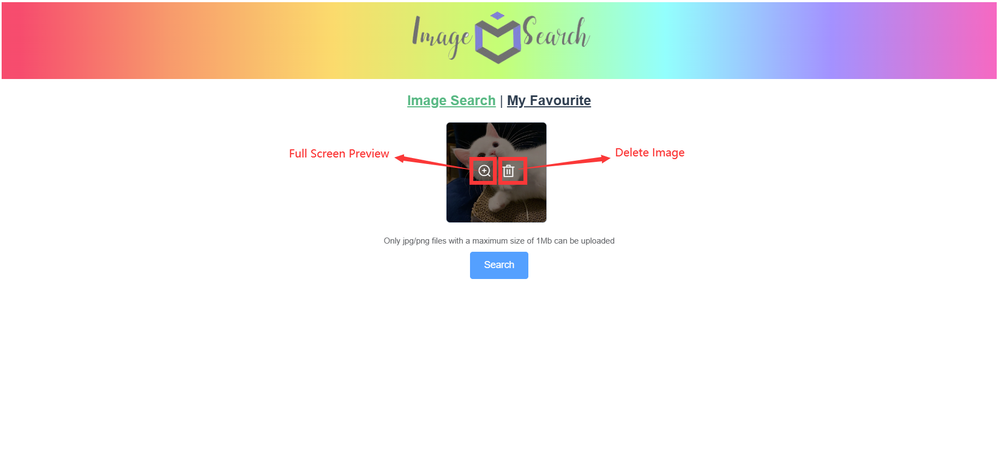
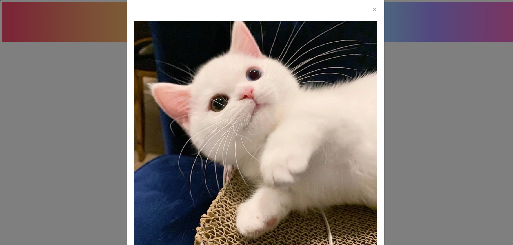
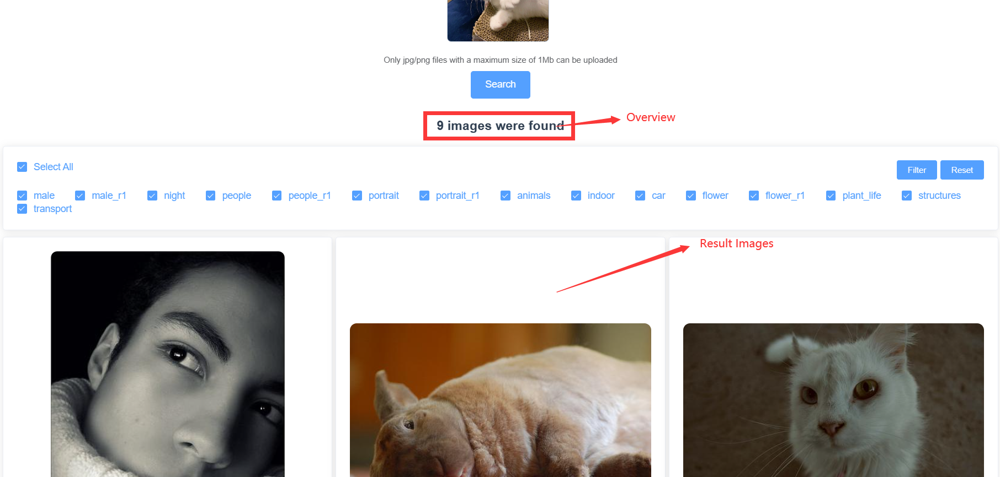
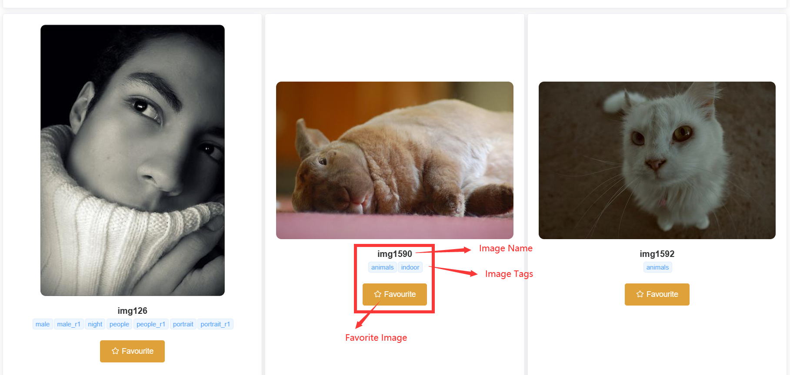
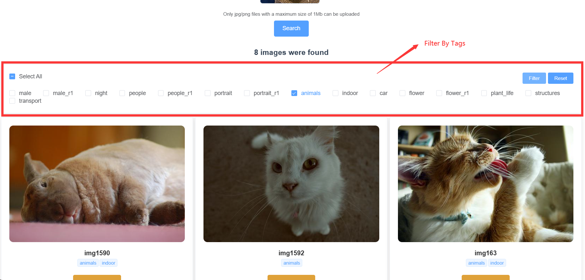
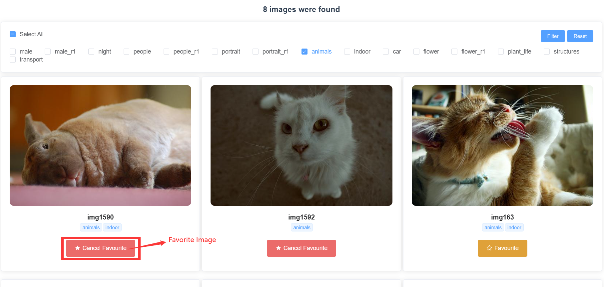
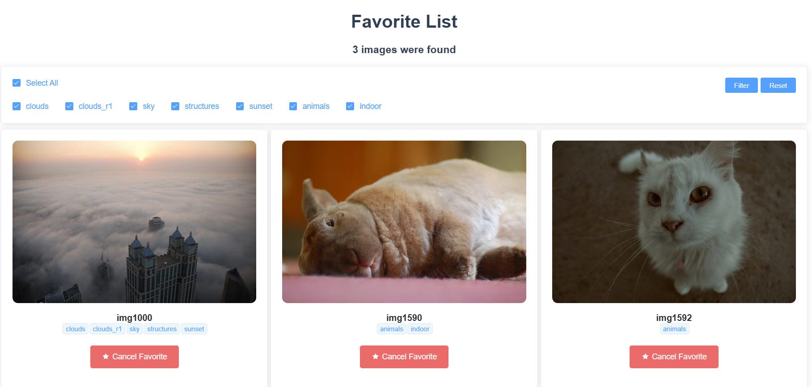

# Lab2 Image Retrieval

[TOC]

## Question1  Describe the Requirements of an Image Search Task

### 1 Definition

Image search task is the process of retrieving all images from a potentially very large image database that contain object instances similar to a query image, based on user-provided keywords or images. Image retrieval has a wide range of applications, such as reverse image search on the web or organizing personal photo collections.

### 2 Requirements

The requirements for an image search task are as follows:

- Accuracy: The search engine needs to accurately match user-provided keywords or images with relevant images in a large-scale image database. This requires the search engine to have high-precision image recognition, classification, and matching capabilities.

- Efficiency: Searching through a large-scale image database requires significant computing resources and storage space. Therefore, the search engine needs to have efficient search algorithms and storage solutions to quickly respond to user requests.

- Diversity: Users may need to search for different types of images, so the search engine needs to have diverse search strategies and classification methods to meet different user needs.

- Visualization: The search engine needs to be able to display search results in an appropriate way to help users quickly and accurately find the desired images.

- User experience: The search engine needs to consider the user's usage scenarios and behaviors, design a simple and easy-to-use search interface and interaction methods, and improve the user's search experience.

### 3 Framework

There is a five-stage search framework help to  coordinate design practices and satisfy the needs of all users.

- Formulation: Define the search question, identify the scope and purpose of the search, and determine the types of sources to be searched.

- Initiation of action: Conduct the search using appropriate search tools and strategies, and identify potential sources of information.
- Review of results: Evaluate the search results to determine their relevance and usefulness, and select the most appropriate sources for further review.
- Refinement: Refine the search strategy as necessary based on the review of initial search results, and conduct additional searches as needed.
- Use: Use the information obtained from the search to meet the needs of all users, and communicate the search results in a clear and concise manner.

## Question2 Show Your Designs for Five Stages

### 1 Formulation

When the user enters the site, the initial interface is displayed as shown below

There is an input box for the user to enter the image, and a prompt below tells the user the format and size requirements for uploading the image.

Under the input box, there is a button that initializes the search after the user uploads the image.

### 2 Initiation

After successfully uploading an image, the user can preview the uploaded image in the input box.

At the same time, when the user hovers over the image, two buttons appear for previewing the image in full screen and deleting the image

When a user clicks on a search, a loading signal will appear before the results are returned to improve the user experience.

### 3 Review of results

Each picture displayed will show the name and tags of the picture. Users can also favorite images by clicking a button.

### 4 Refinement

Users can filter images by tags to refine the result.

### 5 Use

If users come across an image they like, they can click the button `Favorite` to favorite this image.

Users can then switch to their favorites, and discover the new images they added.

In the favorites, user can also filter the images by tags as well as to cancel favorite.

